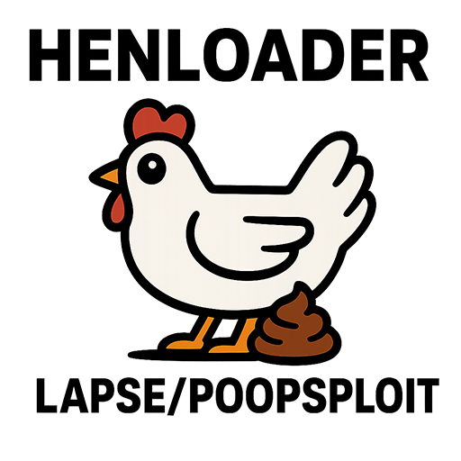

# BD-JB-1252



BD-JB for up to PS4 12.52

---

## Overview

This project provides tools and resources for building BD-J ISO images and executing native code on PS4 systems up to firmware version 12.52. It leverages the BDJ-SDK and ps4-payload-sdk for compilation.

---

## Prerequisites

Before proceeding, ensure you have the following installed on your system:

- **Build tools**: `build-essential`, `libbsd-dev`, `git`, `pkg-config`
- **Java Development Kits**: OpenJDK 8 and OpenJDK 11

---

## Building Steps Debian/WSL

### 1. Get the BDJ-SDK

Clone and set up the BDJ-SDK repository:

```console
sudo apt-get install build-essential libbsd-dev git pkg-config openjdk-8-jdk-headless openjdk-11-jdk-headless
git clone --recurse-submodules https://github.com/john-tornblom/bdj-sdk
ln -s /usr/lib/jvm/java-8-openjdk-amd64 bdj-sdk/host/jdk8
ln -s /usr/lib/jvm/java-11-openjdk-amd64 bdj-sdk/host/jdk11
make -C bdj-sdk/host/src/makefs_termux
make -C bdj-sdk/host/src/makefs_termux install DESTDIR=$PWD/bdj-sdk/host
make -C bdj-sdk/target
```

### 2. Download and Install the ps4-payload-sdk

Clone the ps4-payload-sdk repository and install its dependencies:

```console
sudo apt-get update && sudo apt-get upgrade # optional
sudo apt-get install bash clang-18 lld-18 # required
sudo apt-get install socat cmake meson pkg-config # optional
```

### 3. Download DefKorns Henloader

Clone the ps4-payload-sdk repository:

```console
defkorns@localhost:~$ git clone -b clean-up --single-branch https://github.com/DefKorns/henloader_lp.git
```

### 4. Get bdjstack.jar and rt.jar

Copy `bdjstack.jar` and `rt.jar` from your PS4 system located at `/system_ex/app/NPXS20113` to the appropriate directories in your BDJ-SDK setup (`target/lib`).

---

## Credits

- **[TheFlow](https://github.com/theofficialflow)** — BD-JB documentation & native code execution sources.
- **[hammer-83](https://github.com/hammer-83)** — PS5 Remote JAR Loader reference.
- **[john-tornblom](https://github.com/john-tornblom)** — [BDJ-SDK](https://github.com/john-tornblom/bdj-sdk) and [ps4-payload-sdk](https://github.com/ps4-payload-dev/sdk) used for compilation.
- **[shahrilnet, null_ptr](https://github.com/shahrilnet/remote_lua_loader)** — Lua Lapse implementation, without which BD-J Lapse was impossible.
- **[GoldHEN](https://github.com/GoldHEN)** - henloader_lp
- **[Gezine](https://github.com/gezine/)** - BD-JB-1250
- **[rezbouchabou](https://github.com/rezbouchabou/)** - InitialHenloader Logo
